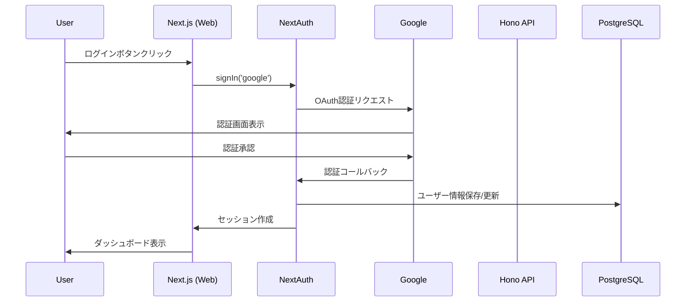

# Google ログイン機能設計書

## 1. 概要
ユーザーがGoogleアカウントでログインし、個人ごとにコンテンツ生成履歴を管理できる機能を実装します。

## 2. 技術選定

### 認証ライブラリ
- **NextAuth.js (Auth.js) v5** - Next.js用の認証ライブラリ
  - Google OAuth 2.0プロバイダー対応
  - セッション管理
  - JWTトークン対応

### 必要なパッケージ
```json
{
  "next-auth": "^5.0.0-beta",
  "@auth/prisma-adapter": "^2.0.0" (オプション：DB連携用)
}
```

## 3. アーキテクチャ設計

### 3.1 認証フロー


### 3.2 データフロー
```
1. 未認証時: 
   - ランディングページ表示
   - ログインボタン表示

2. 認証済み時:
   - ユーザー専用ダッシュボード
   - 個人の履歴表示
   - コンテンツ生成機能へのアクセス

3. API通信:
   - JWTトークンをHeaderに含める
   - APIでトークン検証
   - user_idベースでデータフィルタリング
```

## 4. データベース設計

### 4.1 新規テーブル

#### users テーブル
```sql
CREATE TABLE users (
    id UUID PRIMARY KEY DEFAULT gen_random_uuid(),
    google_id VARCHAR(255) UNIQUE NOT NULL,
    email VARCHAR(255) UNIQUE NOT NULL,
    name VARCHAR(255),
    picture TEXT,
    created_at TIMESTAMP DEFAULT CURRENT_TIMESTAMP,
    updated_at TIMESTAMP DEFAULT CURRENT_TIMESTAMP,
    last_login_at TIMESTAMP
);

CREATE INDEX idx_users_google_id ON users(google_id);
CREATE INDEX idx_users_email ON users(email);
```

#### sessions テーブル (オプション)
```sql
CREATE TABLE sessions (
    id UUID PRIMARY KEY DEFAULT gen_random_uuid(),
    user_id UUID NOT NULL REFERENCES users(id) ON DELETE CASCADE,
    session_token VARCHAR(255) UNIQUE NOT NULL,
    expires_at TIMESTAMP NOT NULL,
    created_at TIMESTAMP DEFAULT CURRENT_TIMESTAMP
);

CREATE INDEX idx_sessions_token ON sessions(session_token);
CREATE INDEX idx_sessions_user_id ON sessions(user_id);
```

### 4.2 既存テーブルの修正

#### content_metadata テーブル
```sql
ALTER TABLE content_metadata 
ADD COLUMN user_id UUID REFERENCES users(id) ON DELETE CASCADE;

CREATE INDEX idx_content_metadata_user_id ON content_metadata(user_id);

-- 既存データのマイグレーション（オプション）
-- デフォルトユーザーまたはNULL許可
```

## 5. 実装計画

### Phase 1: 基盤構築
1. NextAuth.js のセットアップ
   - `/apps/web/app/api/auth/[...nextauth]/route.ts`
   - Google OAuth設定
   - セッション設定

2. 環境変数の追加
   ```env
   # Google OAuth
   GOOGLE_CLIENT_ID=xxx
   GOOGLE_CLIENT_SECRET=xxx
   NEXTAUTH_URL=http://localhost:3000
   NEXTAUTH_SECRET=xxx
   ```

3. データベーススキーマ更新
   - usersテーブル作成
   - content_metadataテーブル修正

### Phase 2: フロントエンド実装
1. 認証コンポーネント
   - `LoginButton.tsx` - ログイン/ログアウトボタン
   - `UserAvatar.tsx` - ユーザー情報表示
   - `AuthProvider.tsx` - セッションプロバイダー

2. ページ保護
   - middleware.tsでの認証チェック
   - 未認証時のリダイレクト

3. UI更新
   - ヘッダーにユーザー情報表示
   - ログイン/ログアウトフロー

### Phase 3: バックエンド実装
1. API認証ミドルウェア
   ```typescript
   // apps/api/src/middleware/auth.ts
   export const authMiddleware = async (c: Context, next: Next) => {
     const token = c.req.header('Authorization')?.replace('Bearer ', '');
     // JWTトークン検証
     // user_idをコンテキストに設定
   };
   ```

2. APIエンドポイント修正
   - user_idベースのフィルタリング
   - 権限チェック

3. サービス層の修正
   - MetadataServiceにuser_id対応
   - コンテンツ作成時にuser_id付与

### Phase 4: テストとデプロイ
1. ローカルテスト
2. Google Cloud Console設定
   - OAuth 2.0クライアント作成
   - 承認済みリダイレクトURI設定
3. 本番環境変数設定
4. デプロイ

## 6. セキュリティ考慮事項

1. **CSRF対策**: NextAuth.jsのCSRF保護を有効化
2. **セッション管理**: セキュアなcookie設定
3. **APIアクセス制御**: JWTトークン検証
4. **データアクセス制御**: user_idベースのフィルタリング
5. **環境変数管理**: Secret Managerの使用

## 7. UI/UXデザイン

### 7.1 ログイン前
```
┌─────────────────────────────────────┐
│  One-to-Multi Agent                 │
│                                      │
│  AIでSNSコンテンツを一括生成         │
│                                      │
│  [Googleでログイン]                  │
│                                      │
│  - テキストから各SNS向けに最適化     │
│  - 音声・動画からも生成可能          │
│  - 履歴管理機能                      │
└─────────────────────────────────────┘
```

### 7.2 ログイン後
```
┌─────────────────────────────────────┐
│  One-to-Multi Agent    [Avatar] ▼   │
├─────────────┬───────────────────────┤
│ Sidebar     │  Dashboard            │
│             │                       │
│ [新規作成]   │  最近の生成履歴       │
│             │  _______________      │
│ 履歴:        │  _______________      │
│ - Item 1    │  _______________      │
│ - Item 2    │                       │
│ - Item 3    │  [コンテンツ生成]     │
└─────────────┴───────────────────────┘
```

## 8. 実装優先順位

1. **必須機能（MVP）**
   - Googleログイン/ログアウト
   - ユーザー情報の保存
   - user_idベースの履歴管理

2. **追加機能（Phase 2）**
   - プロフィール編集
   - アカウント削除
   - 使用量制限
   - 料金プラン（将来）

## 9. テスト計画

1. **単体テスト**
   - 認証フロー
   - API認証ミドルウェア
   - データベースクエリ

2. **統合テスト**
   - ログインフロー全体
   - 認証済みAPI呼び出し
   - セッション管理

3. **E2Eテスト**
   - ユーザージャーニー全体
   - エラーケース

## 10. リスクと対策

| リスク | 影響 | 対策 |
|--------|------|------|
| Google APIの制限 | ログイン不可 | レート制限の監視、エラーハンドリング |
| セッション管理の複雑性 | セキュリティリスク | NextAuth.jsのベストプラクティス遵守 |
| 既存データの移行 | データ不整合 | 段階的移行、バックアップ |
| CORS問題 | API通信エラー | 適切なCORS設定 |