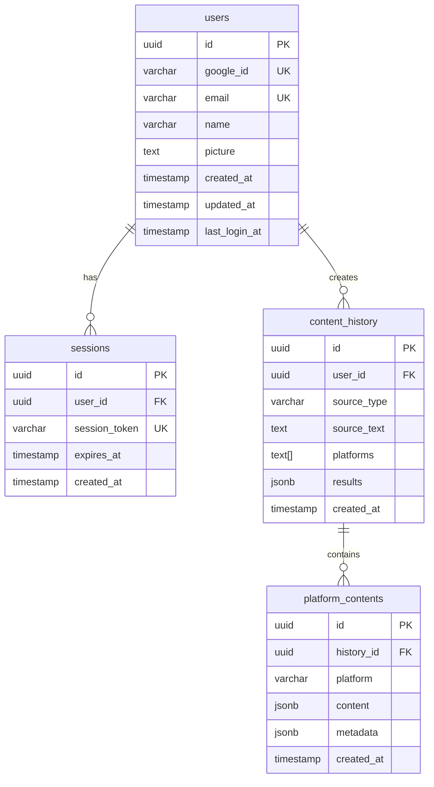

# Database Schema Documentation

## ER Diagram

## Table Details

### 1. users テーブル
ユーザー情報を管理するマスターテーブル

| Column | Type | Nullable | Default | Description |
|--------|------|----------|---------|-------------|
| id | UUID | NOT NULL | gen_random_uuid() | プライマリキー |
| google_id | VARCHAR(255) | NOT NULL | - | Google OAuth ID (ユニーク) |
| email | VARCHAR(255) | NOT NULL | - | メールアドレス (ユニーク) |
| name | VARCHAR(255) | NULL | - | ユーザー名 |
| picture | TEXT | NULL | - | プロフィール画像URL |
| created_at | TIMESTAMP | NULL | CURRENT_TIMESTAMP | 作成日時 |
| updated_at | TIMESTAMP | NULL | CURRENT_TIMESTAMP | 更新日時 |
| last_login_at | TIMESTAMP | NULL | - | 最終ログイン日時 |

**インデックス:**
- PRIMARY KEY: id
- UNIQUE: google_id, email
- INDEX: idx_users_google_id, idx_users_email

**トリガー:**
- update_users_updated_at: 更新時にupdated_atを自動更新

### 2. sessions テーブル
セッション管理テーブル（現在未使用、JWT使用中）

| Column | Type | Nullable | Default | Description |
|--------|------|----------|---------|-------------|
| id | UUID | NOT NULL | gen_random_uuid() | プライマリキー |
| user_id | UUID | NOT NULL | - | ユーザーID (外部キー) |
| session_token | VARCHAR(255) | NOT NULL | - | セッショントークン (ユニーク) |
| expires_at | TIMESTAMP | NOT NULL | - | 有効期限 |
| created_at | TIMESTAMP | NULL | CURRENT_TIMESTAMP | 作成日時 |

**インデックス:**
- PRIMARY KEY: id
- UNIQUE: session_token
- INDEX: idx_sessions_token, idx_sessions_user_id

**外部キー:**
- user_id → users.id (ON DELETE CASCADE)

### 3. content_history テーブル
コンテンツ生成履歴を管理

| Column | Type | Nullable | Default | Description |
|--------|------|----------|---------|-------------|
| id | UUID | NOT NULL | gen_random_uuid() | プライマリキー |
| user_id | UUID | NOT NULL | - | ユーザーID (外部キー) |
| source_type | VARCHAR(20) | NOT NULL | - | ソースタイプ (text/audio/video) |
| source_text | TEXT | NULL | - | 元テキストまたは転写テキスト |
| platforms | TEXT[] | NOT NULL | - | 対象プラットフォーム配列 |
| results | JSONB | NULL | - | 生成結果 |
| created_at | TIMESTAMP | NULL | CURRENT_TIMESTAMP | 作成日時 |

**インデックス:**
- PRIMARY KEY: id
- INDEX: idx_content_history_user_id, idx_content_history_created_at (DESC)

**外部キー:**
- user_id → users.id (ON DELETE CASCADE)

**制約:**
- CHECK: source_type IN ('text', 'audio', 'video')

### 4. platform_contents テーブル
プラットフォーム別のコンテンツ詳細

| Column | Type | Nullable | Default | Description |
|--------|------|----------|---------|-------------|
| id | UUID | NOT NULL | gen_random_uuid() | プライマリキー |
| history_id | UUID | NOT NULL | - | 履歴ID (外部キー) |
| platform | VARCHAR(50) | NOT NULL | - | プラットフォーム名 |
| content | JSONB | NOT NULL | - | コンテンツ詳細 |
| metadata | JSONB | NULL | - | メタデータ |
| created_at | TIMESTAMP | NULL | CURRENT_TIMESTAMP | 作成日時 |

**インデックス:**
- PRIMARY KEY: id
- INDEX: idx_platform_contents_history_id, idx_platform_contents_platform

**外部キー:**
- history_id → content_history.id (ON DELETE CASCADE)

## データベース関係

1. **1対多の関係:**
   - users → sessions: 1人のユーザーが複数のセッションを持つ
   - users → content_history: 1人のユーザーが複数のコンテンツ履歴を持つ
   - content_history → platform_contents: 1つの履歴が複数のプラットフォームコンテンツを持つ

2. **カスケード削除:**
   - ユーザー削除時: 関連するsessions、content_historyも削除
   - content_history削除時: 関連するplatform_contentsも削除

## 現在のデータ状況

### Users テーブル
現在レコード数: 0件
（まだユーザー登録が行われていない）