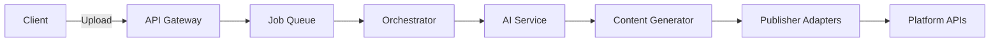

# 🚀 1つのコンテンツから複数SNSへ最適投稿を実現する One-to-Multi Agent

{デモ動画のYouTube URLが必要}

## 背景 - コンテンツクリエイターの悩み

{なぜこのツールを作ったか、個人的な体験・課題感が必要}

{既存ツール（Buffer、Hootsuite等）の問題点が必要}

私たちコンテンツクリエイターは、同じコンテンツを複数のプラットフォームに投稿する際、それぞれのプラットフォームの特性に合わせて手動で調整する必要があります。

- Threadsは会話的でカジュアルなトーン
- WordPressは詳細で構造化された記事形式
- YouTubeは動画説明文とチャプター構成
- X（Twitter）は280文字以内の簡潔な表現
- Instagramは視覚的でハッシュタグ重視
- TikTokは若い世代向けのトレンド感

これらをすべて手動で最適化するのは、時間も労力もかかる作業です。

## One-to-Multi Agent とは

**One-to-Multi Agent** は、1つのソース（テキスト・音声・動画）から、各SNSプラットフォームの文脈・制約・アルゴリズムに最適化した派生コンテンツを半自動生成するツールです。

### 主な特徴

- 📝 **マルチモーダル入力対応**: テキスト、音声、動画をすべてサポート
- 🎯 **6プラットフォーム自動最適化**: 各プラットフォームの特性を理解した上でコンテンツを生成
- 🤖 **Google Gemini 1.5 Flash活用**: 高速かつ高品質な生成AI処理
- ⚡ **カスタマイズ可能なプロンプト**: ユーザーの個性やブランドボイスを反映
- 🔄 **非同期処理でスムーズなUX**: 大容量ファイルも快適に処理

{実際のスクリーンショット - メイン画面が必要}

## 機能紹介

### 3.1 UX要件定義

{具体的なターゲットユーザーのペルソナが必要}

ユーザーが最小限の操作で最大の成果を得られるよう、以下の設計方針を採用しました：

1. **シンプルな3ステップフロー**
   - ソース選択 → プラットフォーム選択 → 生成ボタン

2. **リアルタイムプレビュー**
   - 生成されたコンテンツをその場で編集可能

3. **履歴機能**
   - 過去の生成結果を再利用可能

### 3.2 ユーザーインターフェース

{UI/UXのスクリーンショットが必要}

#### ダークモード対応のモダンなデザイン
```tsx
// Tailwind CSS 4を活用したコンポーネント設計
<div className="bg-gray-800 border border-gray-700 rounded-lg shadow p-6">
  <h2 className="text-xl font-semibold mb-4 text-white">
    1. 入力タイプを選択
  </h2>
  {/* ... */}
</div>
```

#### プラットフォーム選択UI
各プラットフォームをカード形式で表示し、視覚的に分かりやすく選択できます。

{プラットフォーム選択画面のスクリーンショットが必要}

### 3.3 システムアーキテクチャ

#### モノレポ構造による効率的な開発

```
one-to-multi-agent/
├── apps/
│   ├── web/          # Next.js 15 (App Router)
│   └── api/          # Hono API Server
├── packages/
│   ├── core/         # 共通型定義・ビジネスロジック
│   ├── ai/           # AI処理クライアント
│   └── adapters/     # プラットフォームアダプター
└── infra/
    └── docker/       # 開発環境構築
```

#### Orchestrator Service による統括制御

```typescript
// apps/api/src/services/orchestrator-service.ts
export class OrchestratorService {
  private jobService: JobService;
  private transcriberService: TranscriberService;
  private contentService: ContentService;
  private publisherService: PublisherService;
  private promptService: PromptService;

  async processJob(request: ProcessJobRequest): Promise<Job> {
    // 1. ジョブの作成
    const job = await this.jobService.create(request);

    // 2. ソースタイプに応じた前処理
    const content = await this.preprocessContent(request);

    // 3. AI分析と生成
    const generatedContents = await this.generateContents(
      content,
      request.targets,
      request.customPrompts
    );

    // 4. 各プラットフォームへの投稿準備
    return await this.publishContents(generatedContents);
  }
}
```

#### 非同期ジョブ処理アーキテクチャ



{実際のアーキテクチャ図が必要}

### 3.4 AI駆動のコンテンツ最適化システム

#### Gemini APIを活用したマルチモーダル処理

```typescript
// apps/api/src/services/real-ai-service.ts
private async generateFromFile(prompt: string, file: FileSource): Promise<any> {
  const fileManager = new GoogleAIFileManager(process.env.GOOGLE_API_KEY!);

  // ファイルをGeminiにアップロード
  const uploadResult = await fileManager.uploadFile(tempFilePath, {
    mimeType: file.mimeType,
    displayName: file.fileName,
  });

  // ファイル処理の待機
  let fileInfo = await fileManager.getFile(uploadResult.file.name);
  while (fileInfo.state === "PROCESSING") {
    await new Promise(resolve => setTimeout(resolve, 5000));
    fileInfo = await fileManager.getFile(uploadResult.file.name);
  }

  // Gemini 1.5 Flashでコンテンツ生成
  const model = this.genAI.getGenerativeModel({
    model: "gemini-1.5-flash"
  });
}
```

#### カスタマイズ可能なプロンプトシステム

ユーザーごとに異なるブランドボイスや文体を設定できるプロンプトカスタマイズ機能を実装しました。

```typescript
// 3段階のプロンプト構成
1. グローバルキャラクタープロンプト（全体の人格設定）
2. プラットフォーム別プロンプト（各SNSの最適化ルール）
3. カスタムプロンプト（ユーザー独自の指示）
```

{プロンプト設定画面のスクリーンショットが必要}

#### プラットフォーム別最適化ロジック

各プラットフォームの特性を理解し、最適なコンテンツを生成します：

```typescript
// Instagram向け最適化の例
const instagramOptimization = {
  maxCaptionLength: 2200,
  hashtagLimit: 30,
  visualFocus: true,
  emojiUsage: "moderate",
  callToAction: "Link in bio"
};

// TikTok向け最適化の例
const tiktokOptimization = {
  maxLength: 300,
  trendFocus: true,
  hashtagStrategy: "trending",
  audienceAge: "gen-z",
  tone: "energetic"
};
```

### 技術的な工夫点

#### 1. ストレージ抽象化レイヤー

開発環境と本番環境でシームレスに切り替え可能なストレージ設計：

```typescript
// apps/api/src/config/storage.ts
export async function getStorageService(): Promise<FileStorageService> {
  const storageType = process.env.STORAGE_TYPE || 'local';

  if (storageType === 'gcs') {
    const { FileStorageServiceGCS } = await import(
      '../services/file-storage-service-gcs.js'
    );
    return new FileStorageServiceGCS();
  }

  const { FileStorageService } = await import(
    '../services/file-storage-service.js'
  );
  return new FileStorageService();
}
```

#### 2. 動画・音声処理の最適化

ffmpegを活用した効率的なメディア処理：

```typescript
// apps/api/src/services/video-converter-service.ts
export class VideoConverterService {
  async extractAudio(videoPath: string): Promise<string> {
    return new Promise((resolve, reject) => {
      const outputPath = `${videoPath}.mp3`;

      ffmpeg(videoPath)
        .outputOptions([
          '-vn',  // ビデオストリームを無効化
          '-acodec mp3',
          '-ab 128k',
          '-ar 44100'
        ])
        .save(outputPath)
        .on('end', () => resolve(outputPath))
        .on('error', reject);
    });
  }
}
```

#### 3. 認証とセキュリティ

NextAuthを使用したセキュアな認証システム：

```typescript
// apps/web/src/app/api/auth/[...nextauth]/route.ts
export const authOptions = {
  providers: [
    GoogleProvider({
      clientId: process.env.AUTH_GOOGLE_ID!,
      clientSecret: process.env.AUTH_GOOGLE_SECRET!,
    })
  ],
  callbacks: {
    async session({ session, token }) {
      // セッション情報の拡張
      return { ...session, userId: token.sub };
    }
  }
};
```

{技術的な苦労話や解決方法のエピソードが必要}

## まとめ - クリエイターの創造性を増幅する

{AIとの協働についての考え方・哲学が必要}

One-to-Multi Agentは、AIがコンテンツクリエイターの「代替」ではなく「パートナー」となることを目指しています。

### 今後の展望

- [ ] リアルタイム分析ダッシュボード
- [ ] A/Bテスト機能
- [ ] 画像・サムネイル自動生成
- [ ] スケジュール投稿
- [ ] エンゲージメント分析

{ユーザーからのフィードバックや実際の使用例が必要}

{読者へのメッセージが必要}

## リポジトリ

https://github.com/hirosuke0520/one-to-multi-agent

ぜひスターをお願いします！⭐

---

**使用技術**: Next.js 15, React 19, TypeScript, Hono, Google Gemini API, Google Cloud Platform, PostgreSQL, Docker